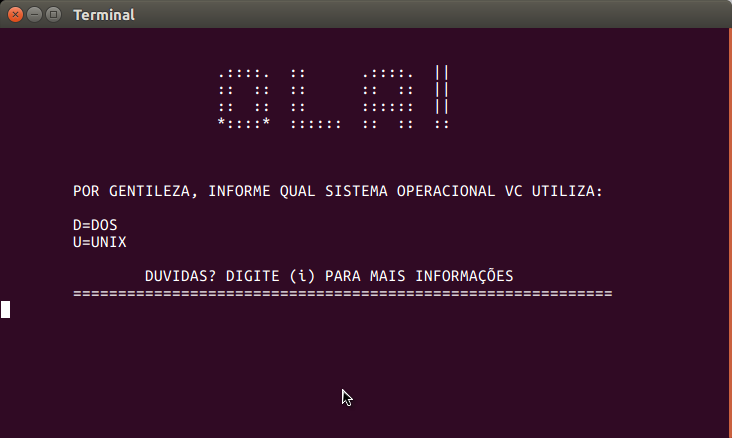
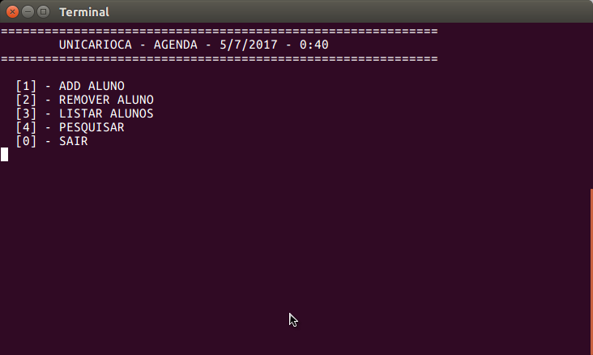

# aps_prog_estruturada

 :eyeglasses:
cadastro de alunos com arquivo persistente  :floppy_disk:
opcões de pesquisa por nome, matricula, aniversariantes do mes e posição no arquivo.  :hushed:
opcçoes de remoção por nome e por matricula.
## tela inicial

## menu principal

