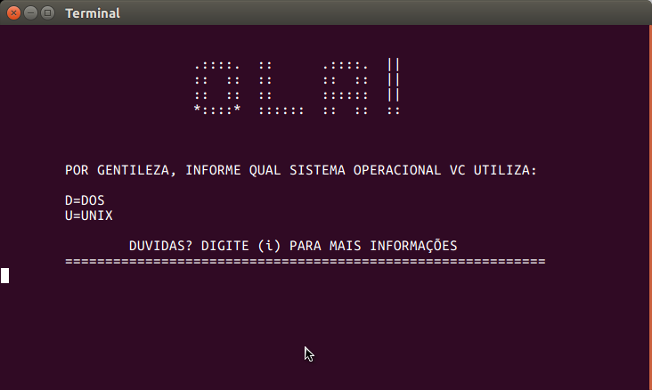
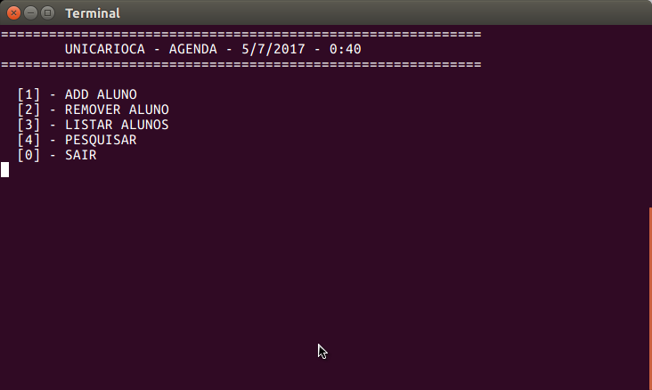

# agenda :ledger:

 :eyeglasses:

cadastro de alunos com arquivo persistente  :floppy_disk:

opcões de pesquisa por nome, matricula, aniversariantes do mes e posição no arquivo.  :hushed:

opcçoes de remoção por nome e por matricula.  :put_litter_in_its_place:

## tela inicial

## menu principal

